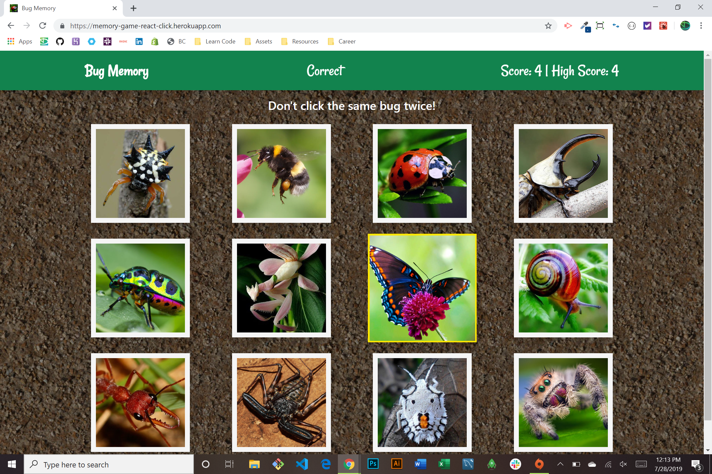

# Bug Memory

### About the Project

Test your memory by selecting every bug card without choosing the same one twice. Each time one is chosen, the game will shuffle the cards and display them in a random order using REACT. If you select the same bug twice, you lose!

  **Visit Web App [Here!](https://memory-game-react-click.herokuapp.com/)**

### Technologies used

* HTML
* CSS
* JavaScript
* Bootstrap
* React.js
* Node.js
